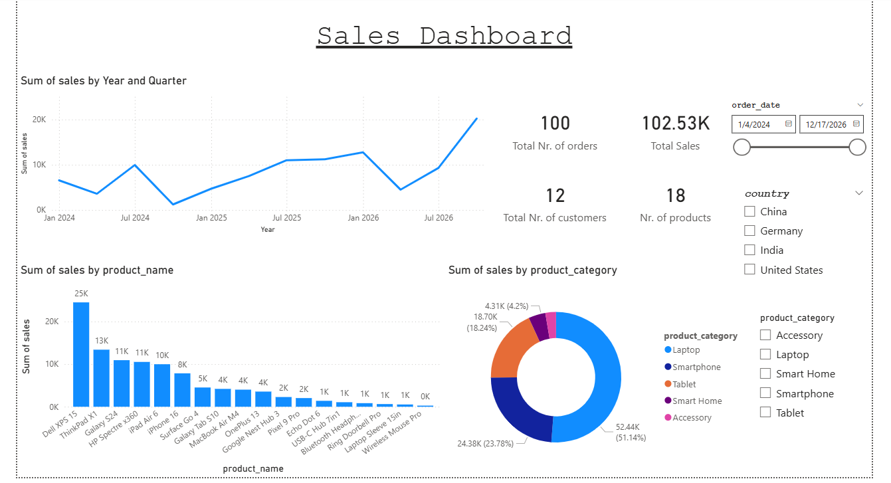

## 📊 Power BI Sales Dashboard

**Interactive business intelligence dashboard**

Built an interactive Power BI dashboard to analyze sales across time, products, and regions. Applied data cleaning and basic DAX to handle missing values, and created visualizations with filters for date, country, and product category.

---

### 📸 Dashboard Preview

---

### ⚙️ Features
- Sales analysis by year and quarter  
- Product-level performance breakdown  
- Category-wise sales distribution  
- Interactive filters (date, country, product category)  
- Key KPIs (total sales, orders, customers, products)

---

### 🛠 Tech Stack
- Power BI  
- DAX (basic)  
- Data Cleaning & Transformation  

---
